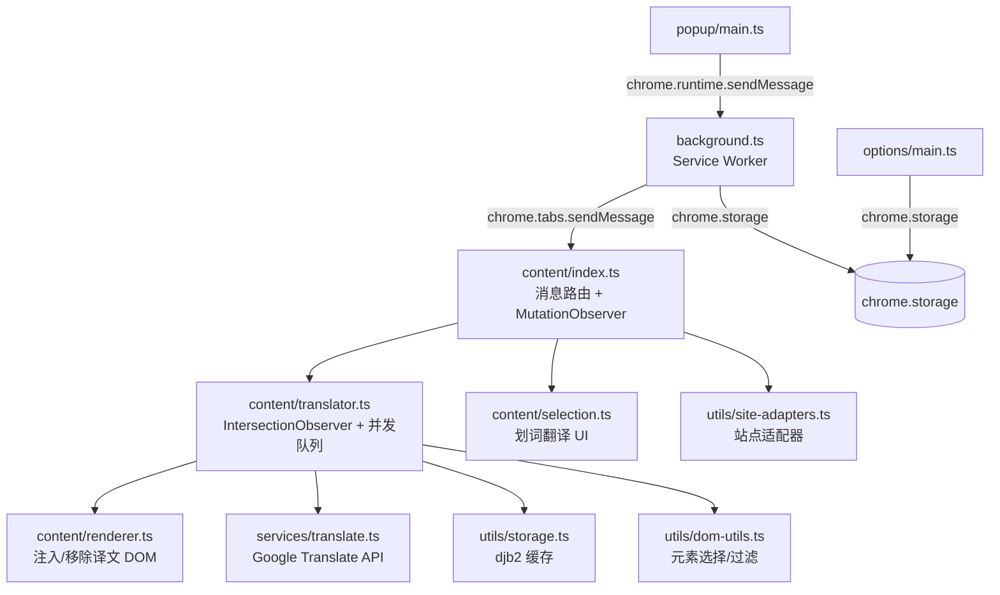

# FluentRead

Chrome 沉浸式双语翻译扩展（MV3）。
WXT (Vite) · TypeScript strict · Tailwind CSS v4 · Vanilla DOM · Vitest + jsdom

## Development Setup

```bash
npm install          # 安装依赖
npm run dev          # 启动 WXT 开发模式（自动打开 Chrome）
npm run build        # 生产构建 → .output/chrome-mv3/
npm run zip          # 打包 .zip（Chrome Web Store 发布）
npm test             # 运行 vitest 测试
npm run test:watch   # 监听模式
npm run typecheck    # TypeScript 类型检查（tsc --noEmit）
npm run lint         # ESLint 检查
npm run lint:fix     # ESLint 自动修复
npm run format       # Prettier 格式化
```

## Architecture



| 目录                            | 职责                                        |
| ------------------------------- | ------------------------------------------- |
| `src/entrypoints/content/`      | Content script — 翻译控制、渲染、划词翻译   |
| `src/entrypoints/popup/`        | 弹出窗口 — 翻译按钮、模式切换、开关         |
| `src/entrypoints/options/`      | 设置页 — 语言默认值、站点管理、缓存清理     |
| `src/entrypoints/background.ts` | Service Worker — 快捷键、消息路由、自动翻译 |
| `src/services/`                 | API 封装 — Google Translate 重试/限流       |
| `src/utils/`                    | 工具 — DOM 过滤、翻译缓存、站点适配器       |
| `tests/`                        | Vitest + jsdom 测试（10 个文件）            |

- **WXT 框架** — 自动生成 manifest，HMR 热更新，路径别名 `@/` → `src/`
- **Tailwind CSS v4** — 通过 `@tailwindcss/vite` 插件集成（popup + options），content script 用 plain CSS
- **Storage 分层** — `chrome.storage.local`（设备本地数据 + 翻译缓存）、`chrome.storage.sync`（跨设备用户偏好）、`chrome.storage.session`（SW 重启后保持的 tab 翻译状态）
- **快捷键** — `Alt+T`（切换翻译）、`Alt+M`（切换模式），通过 `chrome.commands` 注册

## Git Hooks

- **Pre-commit**（husky + lint-staged）: 提交时自动运行 `eslint --fix` + `prettier --write`（TS 文件）和 `prettier --write`（CSS/HTML/JSON），然后运行 `npm test`
- 测试不通过会阻止提交

## Code Conventions

- Conventional Commits: `feat:`, `fix:`, `docs:`, `refactor:`, `test:`, `chore:`
- TypeScript strict mode, camelCase 函数名，UPPERCASE 常量
- async/await 优于 .then()
- CSS 使用 custom properties（--color-_，--spacing-_）
- 深色模式通过 `@media (prefers-color-scheme: dark)` 自动切换

## Key Patterns

- **Placeholder 协议** — `extractPlaceholders` 用 `__TAG_N__` 占位 code/sup/sub（保存 `outerHTML`，内容不翻译），用 `__LSN__`/`__LEN__` 标记链接边界（文字参与翻译）。`restorePlaceholders` 直接插入原始 outerHTML 还原标签（保留原始 class 和内部结构）。见 `translator.ts`
- **可见区优先翻译** — `IntersectionObserver` 分类 visible/offscreen 元素，visible 优先入队。并发上限 `MAX_CONCURRENT=3`，请求间隔 `REQUEST_INTERVAL_MS=100`。见 `translator.ts`
- **Session 模式** — 每次 `translatePage` 创建新 `TranslationSession`，旧 session 标记 `cancelled=true`。所有异步操作在执行前检查 `s.cancelled`，取消时清理残留的 loading 指示器（`removeTranslation`）。见 `translator.ts`
- **MutationObserver 自循环防护** — 检测 `fluentread-translation` class 跳过自身注入的 mutation，防止无限循环。300ms debounce + 500 条 mutation 上限。见 `content/index.ts`
- **DOM 过滤链** — `TRANSLATABLE_TAGS` → `EXCLUDED_SELECTORS` → `CODE_HOST_ALLOWED_CONTAINERS` → `MIN_TEXT_LENGTH(5)` → `isCJKDominant` → `looksLikeCode`。修改任一环节需全链路回归测试。见 `dom-utils.ts`
- **CSS 命名空间隔离** — Content script 所有类名用 `fluentread-` 前缀，CSS custom property 用 `--fr-` 前缀，避免与宿主页面冲突
- **`_internals` 可测试性模式** — `translate.ts` 暴露 `_internals.delay` 供测试 stub，避免 mock 全局 `setTimeout`
- **WXT 全局函数** — `defineBackground`、`defineContentScript` 由 WXT 框架注入，不需要 import。ESLint globals 中已声明

## Build & CI

本地完整检查（提交前自动运行 lint + test）：

```bash
npm run typecheck && npm run lint && npm run format:check && npm test && npm run build
```

CI（GitHub Actions，`.github/workflows/ci.yml`）：typecheck → lint → format:check → test → build，Node 20，push/PR to main 触发。

## Security

- **HTML 注入防护** — `escapeHtml` / `escapeAttr`（`translator.ts`）对所有翻译结果转义后再通过 `restorePlaceholders` 构建受控 HTML。禁止将用户可控内容直接赋值给 `innerHTML`
- **`innerHTML` 白名单** — 仅 `renderer.ts:renderTranslation` 中使用 `div.innerHTML = html`，且 `html` 来源必须是 `restorePlaceholders` 的输出（已转义）。`selection.ts` 的 SVG icon 是硬编码常量
- **API 密钥** — 当前使用 Google Translate 非官方端点（无 API key）。如果未来切换到需要 key 的服务，密钥必须存储在 `chrome.storage` 中，禁止硬编码到源码
- **Content script 隔离** — 所有注入的 DOM 元素使用 `fluentread-` 前缀类名，`z-index: 2147483647` 确保划词卡片不被宿主页面遮挡

## Known Issues

- @TODOS.md 中有完整的待办列表
